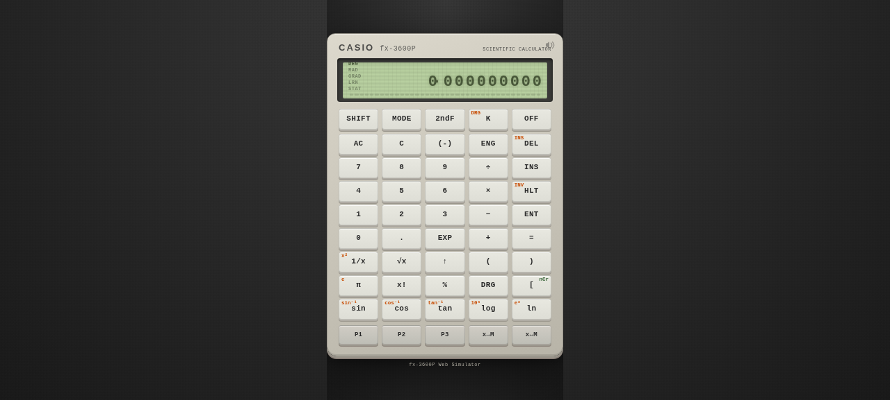

# CASIO fx-3600P Simulator

A faithful web-based recreation of the classic CASIO fx-3600P programmable scientific calculator from the 1980s.

## Features

- **Realistic 80s calculator aesthetic** — LCD ghost-segment display, authentic key layout, and audio feedback
- **Full fx-3600P key set** — all scientific functions, memory operations, angle modes (DEG/RAD/GRAD)
- **Keystroke programming** — three program slots (P1, P2, P3) with learn (LRN) mode, labels, conditional jumps, and pauses (HLT/ENT)
- **Statistics mode** — single-variable statistical calculations

## How to Use

Open `index.html` in any modern web browser.

### Modes

Press `MODE` to cycle through calculator modes:
- **CALC** — normal calculation
- **LRN** — learn mode for recording keystroke programs
- **STAT** — statistics mode
- **SD** — single-variable statistical mode

### Programming

1. Press `MODE` to enter **LRN** mode
2. Press `P1`, `P2`, or `P3` to select a program slot
3. Type your calculation sequence (e.g. `2 + 3 =`)
4. Press `AC` to exit LRN and save the program
5. Press `P1/P2/P3` to run the program

### Conditional Jumps

In LRN mode, use `SHIFT` + `X=0`, `SHIFT` + `X≥0`, etc. for conditional branching within programs.

## License

This project is licensed under the [GNU General Public License v3.0](LICENSE).
